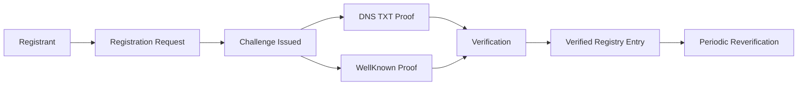

# Registry Security Specification

This document defines security requirements for the optional GSS central registry.

The registry is a fallback discovery mechanism. It must not override domain-controlled discovery sources.

## Discovery Trust Order

Consumers MUST resolve shop endpoints in this order:

1. `https://<shop-domain>/.well-known/gss.json`
2. DNS TXT `_gss.<shop-domain>`
3. Central registry

If sources conflict, higher-priority sources win.

## Registration and Verification Flow

1. Registrant submits a domain + endpoint registration request.
2. Registry issues a short-lived domain ownership challenge.
3. Registrant proves ownership through DNS TXT or `.well-known` verification.
4. Registry verifies proof and marks entry `verified`.
5. Registry schedules periodic re-verification.

## Verification Methods

### DNS TXT (recommended)

- Host: `_gss-verify.<shop-domain>`
- Type: `TXT`
- Value format:
  - `gss-verify=<challenge_id>; token=<challenge_token>`

### Well-known verification

- URL: `https://<shop-domain>/.well-known/gss-verification`
- Payload fields:
  - `challenge_id`
  - `token`
  - `issued_by`
  - `timestamp`

## Security Requirements

- Challenge TTL MUST be short (recommended 15-30 minutes).
- Unverified registrations MUST NOT be returned as trusted.
- Endpoint updates MUST require re-verification.
- Verified domains MUST be re-verified periodically (recommended 30-90 days).
- Registrations MUST be rate-limited and abuse-protected.
- Conflict claims MUST trigger owner notification and manual/automated dispute handling.
- Registry SHOULD maintain an append-only transparency log of domain claims and verification events.

## Consumer Safety Behavior

Consumers SHOULD:

- warn when discovery is registry-only
- warn when `status != verified`
- surface verification metadata (method, timestamp, next reverify date)
- avoid trust downgrade when domain-controlled sources disagree with registry fallback

## API Error Codes

- `CHALLENGE_EXPIRED`
- `DOMAIN_NOT_VERIFIED`
- `DOMAIN_ALREADY_VERIFIED`
- `VERIFICATION_CONFLICT`
- `ENDPOINT_REQUIRES_REVERIFICATION`
- `RATE_LIMITED`
- `ABUSE_BLOCKED`

## Schema References

- `schemas/registry/registration-request.schema.json`
- `schemas/registry/challenge-response.schema.json`
- `schemas/registry/verification-response.schema.json`
- `schemas/registry/error-response.schema.json`

## Conformance Checklist

Use `docs/registry-conformance-checklist.md` to validate whether a registry implementation meets required security and behavior guarantees.
